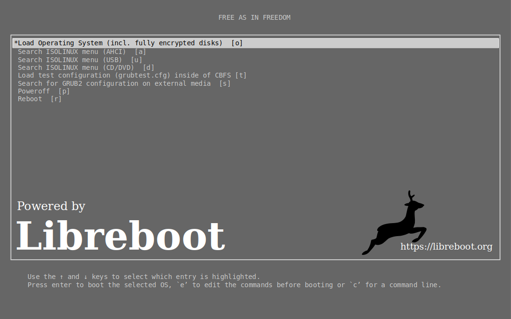
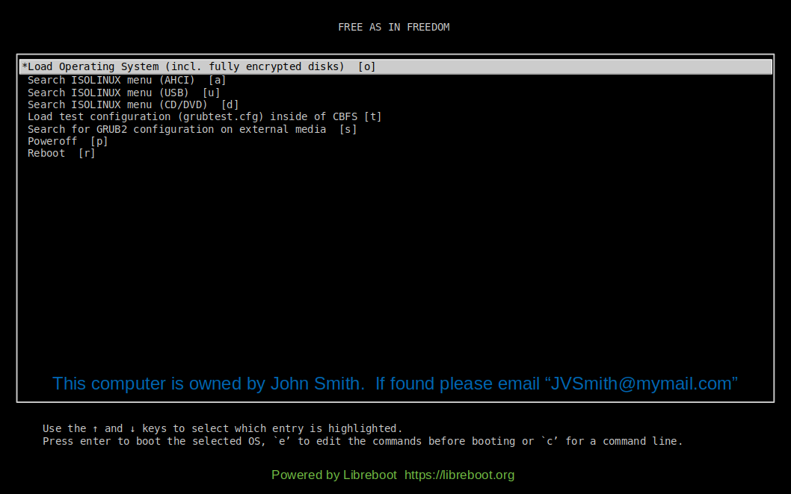

#Purpose

This repository contains a makefile and instructions for adding custom
bootsplash images such as the ones below to a libreboot rom.  The default
parameters and instructions are currently targeted at the Thinkpad X200
platform but other libreboot computers may be added in the future.

|Example 1|Example 2|
|---------|---------|
|||

For more info on what libreboot is see <https://libreboot.org>

#Usage

These are quick instructions to create a libreboot rom containing a custom
splash image:

1. Clone this git repository.
2. Ensure you have the dependencies mentioned in the section below installed.
3. Change to the repository and edit "config.mk" to match the parameters for
   the target computer you are installing to.
4. Type "make"
5. Flash the custom libreboot rom image stored in "build/libreboot_custom/..."

For instructions on how to flash a libreboot rom refer to the "install"
instructions on the libreboot website at <https://libreboot.org>

#Dependencies

Ensure the following is installed in your particular linux system:

- make
- wget
- gpg

In addition the following will be needed but are likely already installed:

- sha512sum
- sed
- tar
- cat
- grep

#"config.mk" parameters

The "config.mk" file is used to select various desired parameters and
customizations.  Edit the parameters in the file carefully.  These are directly
used by the makefile to download and check files from the libreboot website so
typos and incorrect case will cause issues.

- LB_VER: The libreboot version to download
- LB_MIR: Path to the internet mirror containing libreboot files
- LBR_COM: The particular libreboot computer platform to target
- LBR_SIZ: Rom chip size in megabytes
- LBR_KEY: Keyboard format used on your target computer
- LBR_DIS: This should always be "vesafb" if you intend to use a graphical
  splash boot screen.
- LBR_LOD: The boot loader type ("grub" or "seabios")
- LBR_MAC: You **must** change this to match the mac address of your target
  computer
- IMG_NAM: The name of the splash image in the "images" subdir
- IMG_EXT: The filename extension of the splash image ("png" or "jpg")
- LBU_CPU: This is the architecture of the **host computer** running this
  makefile. ("x86_64", "i686", or "armv7l")

#Creating Custom Splash Images

The example splash images in this repository were created using the LibreOffice
Draw application (files ending in ".odg").  Although there are many
applications able to create png and jpg images that can be used as splash
screens it's helpful to note that the grub bootloader in the libreboot rom
cannot handle some of the advanced image features in the png and jpeg
standards.  These instructions explain how to create graphics targeting the
ThinkPad X200 laptop and export a png image that it is compatible with
libreboot.  At the time of this writing LibreOffice version 5.4.7.2 was used.

1.  Start the LibreOffice application, select "Open" and then select the
    "x200_grub_menu.odg" file from the "images" subdirectory in this
    repository.
2.  From the top menu bar select "File" -> "Save As" and select a new name for
    the custom splash image you will be creating.
3.  At the very bottom of the screen note that there is a "Grub Menu" tab which
    represents a layer in LibreOffice Draw containing a representation of the
    grub text menu that displays when libreboot starts up.  This layer provides
    a useful visual reference for what the grub menu will look like when
    libreboot starts up on your computer.
4.  Select the "Layout" tab at the bottom of the screen so that any graphics or
    text that you add to your custom splash screen is on a different layer from
    the grub menu layer.
5.  Update the "Layout" tab as desired with any modifications you wish to make.
6.  For example from the top menu bar you can click on "Format" -> "Page
    Properties" and select the "Background" tab to modify the background color
    or insert a bitmap image etc.
7.  Also in "Page Properties" you will note that the "Page" tab has been pre
    selected with a "Screen 16:10" size and "Landscape" format.  If you are
    targeting a splash screen for a different computer with another screen size
    you will need to modify this accordingly.
8.  Once you have the splash screen set up the way you want in LibreOffice Draw
    you will need to delete the "Grub Menu" layer so that it isn't included in
    the exported graphic file.  Right click on the "Grub Menu" tab and the
    bottom and select "Delete".  The grub menu text should disappear leaving
    your custom splash remaining on the "Layout" layer.  Note that it may be
    tempting to modify the "Grub Menu" layer to make it not visible and not
    printable but this unfortunately has no effect on exporting.  The only way
    to ensure the grub menu layer doesn't make it into the exported graphic
    file is to delete the layer.
9.  From the top menu bar select "File" -> "Export" and then type in the
    filename you wish to export your splash screen to with the ".png" file
    extension and then click "Save".
10. A dialog menu should pop up asking for specific png file options.  For the
    x200 ThinkPad laptop you need to ensure that the width is 1280 pixels and
    height is 800 pixels (see reference section below).  Also make sure that
    "Interlaced" and "Save transparency" options are unchecked.  The rest you
    can leave at their defaults and then click "OK".
11. Make sure that the exported file is in the "images" sub directory in the
    repository and then update "config.mk" to use the name of the image file
    you just exported.

#Reference - Display sizes for Libreboot laptops
|Laptop Model |Pixel Width|Pixel Height|Aspect Ratio|
|-------------|-----------|------------|------------|
|Lenovo x200  |1280       |800         |16:10       |

#Copyright

Copyright (C) 2018 Jason T. Lenz

#License

Unless otherwise noted all files in this repository are under the MIT license
as described in the "LICENSE" file in this repository.  The Libreboot logo in
the images subdirectory is the exception and is licensed (CC-0) as described at
<https://libreboot.org/logo/license.html>
